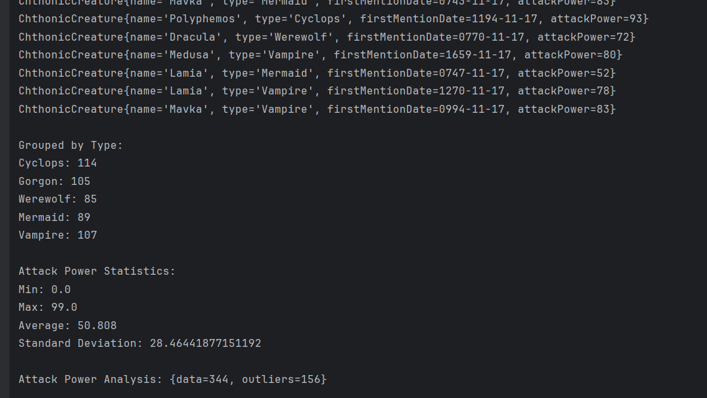

# chthonic-streams

Автор проєкту: Вікторія Сабадан, ІМ-22.

# Опис проєкту

Цей застосунок демонструє використання Java Streams API шляхом симулювання 
генерації, аналізу та категоризації хтонічних істот (міфічних створінь). 
Головною метою застосунку є показ того, як працювати зі стрімами, використовувати колектори
та виконувати статистичний аналіз великого набору даних випадково згенерованих істот.

В результаті виконання програми виводиться список із 500 згенерованих об'єктів
 та результати групування, статистика та аналіз сили атаки.

Приклад виводу:


# Інструкції по збірці і запуску

Для встановлення застосунку Вам необхідно попередньо встановити Java на свою машину.

### Перший варіант: використання готового JAR архіву з цього репозиторію

[chthonic-streams.jar](chthonic-streams.jar)

Після встановлення архіву, у консолі переходимо у директорію з ним та можемо користуватися програмою.

### Другий варіант: самостійна збірка JAR (програмний інтерфейс Intellij IDEA)

Клонуємо репозиторій і відкриваємо його в Intellij IDEA.

У меню обираємо File - Project Structure - Artifacts - + - JAR - From modules with dependencies.

Обираємо Main як головний клас та натискаємо "ОК".

Далі в меню обираємо Build - Build Artifacts - Build.

У структурі проєкту з'являється директорія "out", у якій і є наш JAR-файл. Тепер можна скопіювати його у будь-яку бажану
директорію Вашого комп'ютера.

### Третій варіант: самостійна збірка JAR (командний рядок)

Клонуємо репозиторій на свою машину. У консолі git під час знаходження
у склонованій директорії прописуємо

```
jar -cf chthonic-streams.jar *
```

та шукаємо JAR-файл у директорії проєкту.

### Четвертий варіант: клонування цього репозиторію на сво машину та запуск з інтерфейсу IDE

Клонуємо репозиторій та відкриваємо у середовищі розробки. Запускаємо метод Main.main().